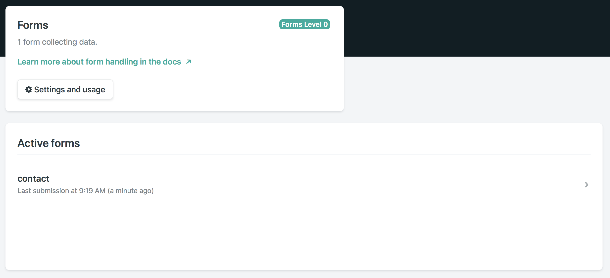
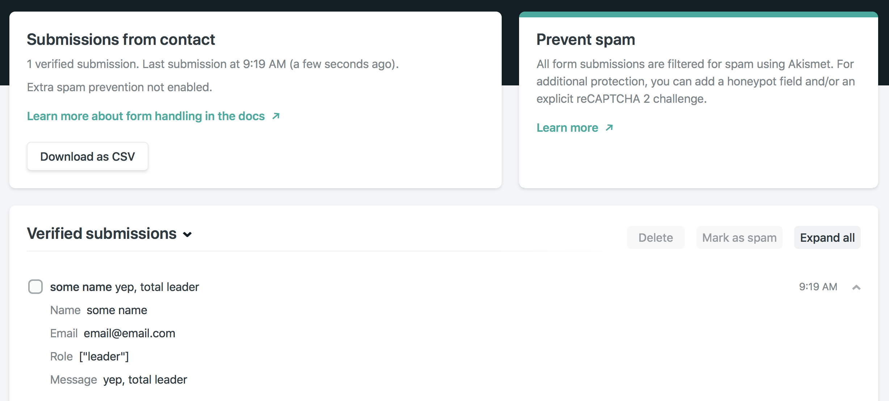

# Demo: Netlify Forms

This is a super-simple demo of Netlify Forms, essentially using the same snippet they are officially providing at [https://www.netlify.com/docs/form-handling/](https://www.netlify.com/docs/form-handling/). I've also added a custom success page, by way of the `action` attribute on the form element.

## Instructions

Simply upload this to Netlify. Easiest way for this kind of demo, is by compressing this repo into a ZIP and dragging it to the manual deployment dropzone in the "Deploys" tab. Forms should be automatically detected during deployment.

## How it looks inside of Netlify

### CSV output

The repo also contains a CSV output (with my IP masked) so you can see what to expect from such CSVs.
